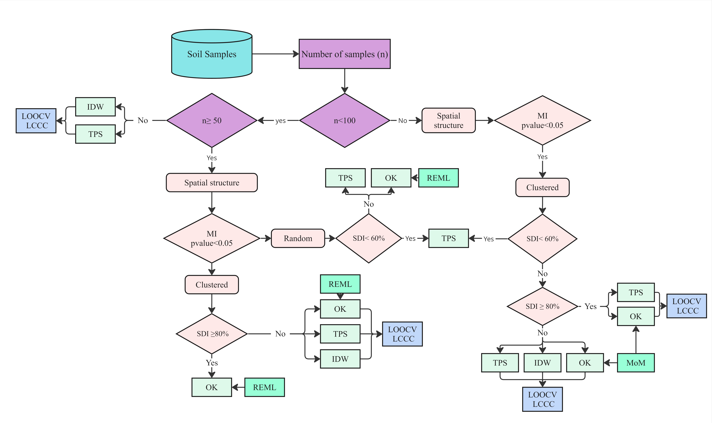
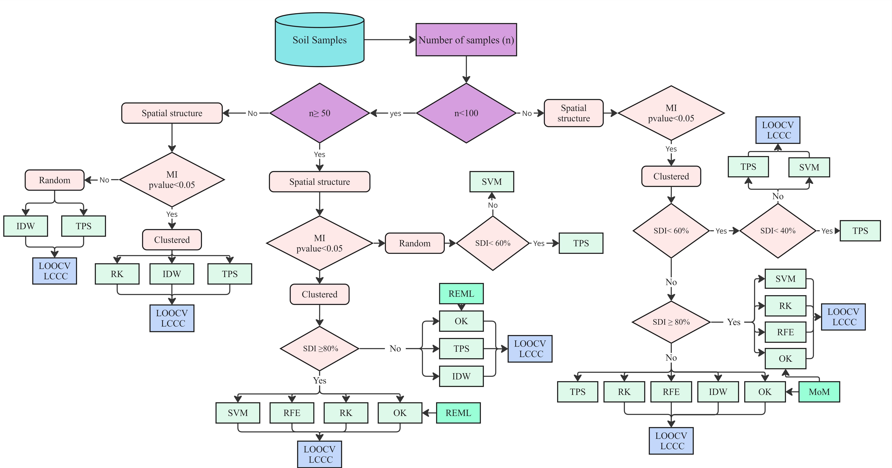

# Best Fit Interpolator

<p align="center">
  
</p>

<p align="center">
  <strong>A QGIS plugin for selecting, validating, and applying the most suitable spatial interpolation method for environmental and soil data.</strong>
</p>

<p align="center">
  <a href="https://github.com/ladelgadobe/BestFitInterpolation/issues">Report an issue</a> |
  <a href="https://doi.org/10.1007/s11119-025-10311-8">Reference article</a> |
  <a href="mailto:ladelgadobe@unal.edu.co">Contact</a>
</p>

## Overview

Best Fit Interpolator is a QGIS plugin designed to support spatial interpolation workflows, especially in digital soil mapping and precision agriculture. It helps users inspect their data, compare interpolation methods, validate predictions, and generate interpolation maps from point samples and polygon boundaries.

The plugin combines deterministic, geostatistical, machine-learning, and hybrid approaches in a single workflow:

- Inverse Distance Weighting (IDW)
- Thin Plate Spline (TPS)
- Ordinary Kriging (OK)
- REML-assisted kriging
- Random Forest (RF)
- Support Vector Machine (SVM)
- Regression Kriging (RK)

## Main Features

- Data diagnostics for point samples, variables, polygon limits, sample size, and spatial pattern.
- Semivariogram preview and geostatistical tools for kriging workflows.
- Cross-validation with RMSE, RMSE %, MAE, Pearson r, R2, and LCCC.
- Observed-vs-predicted plots for comparing model behavior.
- Framework-guided method selection inspired by the reference article.
- Interpolation map generation directly inside QGIS.
- PDF report support for framework validation outputs.

## Framework Guidance

The Framework tab guides method selection using the data characteristics and the decision structure proposed in the reference article.

<p align="center">
  
</p>

<p align="center">
  
</p>

## Installation

1. Download or clone this repository.
2. Copy the `bestfitinterpolator` folder into your QGIS plugins directory.
3. Open QGIS and enable **Best Fit Interpolator** from the Plugin Manager.

Typical QGIS plugin directory on Windows:

```text
C:\Users\<user>\AppData\Roaming\QGIS\QGIS3\profiles\default\python\plugins
```

## Authors

- [Laura Delgado Bejarano](https://www.linkedin.com/in/laura-delgado-bejarano-09b6681a2/)
- [Lucas Rios do Amaral](https://www.linkedin.com/in/lucas-rios-do-amaral-bb302449/)

Contact: [ladelgadobe@unal.edu.co](mailto:ladelgadobe@unal.edu.co)

## Citation

Delgado Bejarano, L., Loureiro Goncalves Oliveira, A., Fiolo Pozzuto, J. V., Castaneda Sanchez, D., & Rios do Amaral, L. (2026). *Performance of interpolation methods in digital soil mapping: the influence of data characteristics*. Precision Agriculture, 27(1), 10. https://doi.org/10.1007/s11119-025-10311-8

## Repository

- Homepage: https://github.com/ladelgadobe/BestFitInterpolation
- Issues: https://github.com/ladelgadobe/BestFitInterpolation/issues
