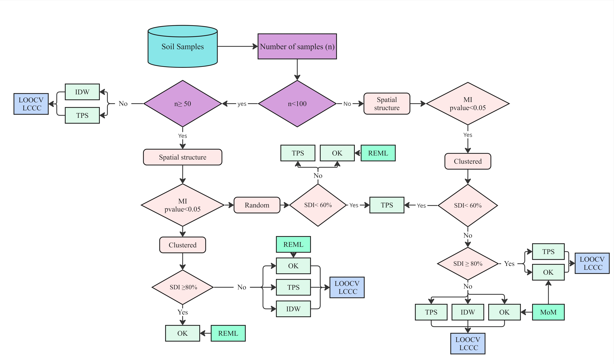
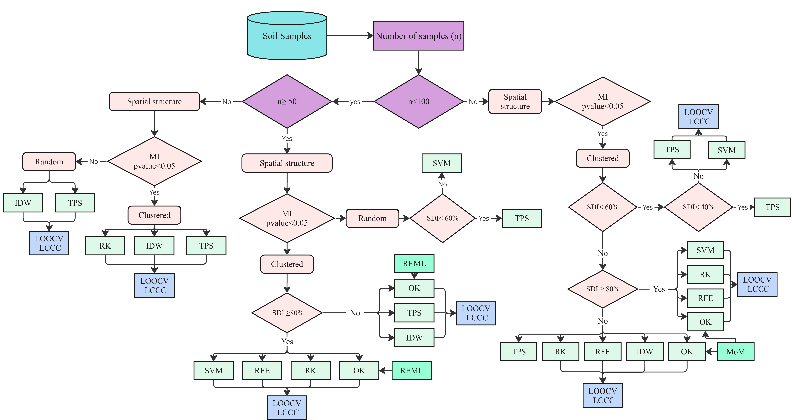

# Best Fit Interpolator — FARM Analytica Fork

> **Note:** This repository is a [FARM Analytica](https://farmanalytica.com.br) fork of the original
> [Best Fit Interpolator](https://github.com/ladelgadobe/BestFitInterpolation) project by
> Laura Delgado Bejarano and Lucas Rios do Amaral. It is maintained independently for use in
> FARM Analytica workflows. All credit for the original plugin, methodology, and reference
> article belongs to the original authors (see [Authors](#authors) and [Citation](#citation)).

<p align="center">
  
</p>

<p align="center">
  <strong>A QGIS plugin for selecting, validating, and applying the most suitable spatial interpolation method for environmental and soil data.</strong>
</p>

<p align="center">
  <a href="https://github.com/farmanalytica/bestfitinterpolator/issues">Report an issue (fork)</a> |
  <a href="https://github.com/ladelgadobe/BestFitInterpolation">Upstream project</a> |
  <a href="https://doi.org/10.1007/s11119-025-10311-8">Reference article</a> |
  <a href="mailto:ladelgadobe@unal.edu.co">Contact</a>
</p>

## Overview

Best Fit Interpolator is a QGIS plugin designed to support spatial interpolation workflows, especially in digital soil mapping and precision agriculture. It helps users inspect their data, compare interpolation methods, validate predictions, and generate interpolation maps from point samples and polygon boundaries.

The plugin combines deterministic, geostatistical, machine-learning, and hybrid approaches in a single workflow:

- Inverse Distance Weighting (IDW)
- Thin Plate Spline (TPS)
- Ordinary Kriging (OK)
- REML-assisted kriging
- Random Forest (RF)
- Support Vector Machine (SVM)
- Regression Kriging (RK)

## Main Features

- Data diagnostics for point samples, variables, polygon limits, sample size, and spatial pattern.
- Semivariogram preview and geostatistical tools for kriging workflows.
- Cross-validation with RMSE, RMSE %, MAE, Pearson r, R², and LCCC.
- Observed-vs-predicted plots for comparing model behavior.
- Framework-guided method selection inspired by the reference article.
- Interpolation map generation directly inside QGIS.
- All computation runs in background threads with cancel support.

## Usage

Open the plugin from the toolbar icon or **Plugins > Best Fit Interpolator**.
The dialog is organized into tabs that follow the interpolation workflow:

### Data

Select the point layer, the numeric variable to interpolate, and the boundary
polygon, then click **Load**. The tab reports the layer CRS (with warnings for
geographic CRS or CRS mismatches), the number of valid samples, and the
spatial pattern (global Moran's I with a permutation p-value, classified as
Clustered / Random / Dispersed). The pixel size and the "Export Rasters to
project folder" option set here apply to every method. When exporting is
enabled and the project is saved, rasters are written to a
`BestFitInterpolation` folder next to the project file; otherwise they go to
the system temp folder and are flagged as temporary layers.

### Deterministic (IDW / TPS)

Choose **Manual parameters** (power *p* and neighbors *n*), **Optimize IDW**
(a cross-validated grid search over *p* ∈ 0.5–6.0 and *n* ∈ 4–16 scored by
ISI), or **Thin plate spline**. **Interpolate** writes the raster and shows a
preview; the **Validation** sub-tab runs cross-validation (Auto / LOOCV /
K-Fold) and reports RMSE, RMSE %, MAE, Pearson r, R², and LCCC with an
observed-vs-predicted plot. The automatic policy uses LOOCV up to 100 samples,
10-fold up to 1000, and 5-fold above that.

### Geostatistics (Ordinary Kriging)

**Calculate…** fits the semivariogram. The fit method follows the original
rules: *Automatic* uses REML for fewer than 100 valid samples (when SciPy is
available) and MoM otherwise; manual *REML* is limited to fewer than 500
samples; *MoM* fits the theoretical model to the binned experimental
semivariogram. The model can be fixed (Spherical / Exponential / Gaussian) or
chosen automatically — **View validation** compares the three models by LOOCV.
Fitted nugget, partial sill, and range land in editable spin boxes, along with
the Spatial Dependence Index (SDI). **Interpolate…** and the Validation
sub-tab use exactly the parameters shown.

### Machine Learning (RF / SVM / Regression Kriging)

The **Covariables** sub-tab manages covariate rasters (add/remove), the
"use x, y as predictors" option, and a correlation matrix between the target
and the covariates. **Random Forest** and **SVM** support manual
hyperparameters or a bounded random search (seeded, reproducible). The
**Kriging** sub-tab runs Regression Kriging: an RF trend plus ordinary kriging
of the RF residuals, with residual-variogram and variable-importance
diagnostics. Each method has its own validation sub-tab.

### Framework

Guided method selection based on the reference article: **Analyze data**
summarizes sample size, spatial structure, SDI, and covariate availability;
**Recommend method** walks the decision tree and highlights the suggested
method; the **Validation** sub-tab cross-validates any selection of the six
methods in one run and ranks them (failed or skipped methods are reported
explicitly, never counted as successful); the **Interpolation** sub-tab runs
the chosen method.

## Version 2.0.0 (FARM Analytica fork)

Full backend restructure of this fork:

- All interpolation, cross-validation, and raster generation run in background
  threads with cancel support — QGIS stays responsive during computation.
- One method registry (IDW, TPS, OK, RF, SVM, RK) drives every tab and the
  Framework; the Framework reports failed methods explicitly instead of
  treating them as successful.
- Polygon interior rings (holes) are now excluded from interpolation masks.
- Cancelling a run never leaves a truncated raster on disk.
- TPS fits its spline once per run instead of once per raster chunk and per
  validation fold; covariate rasters are read in blocks instead of per cell.
- scikit-learn is provisioned automatically into an ABI-tagged `extlibs`
  folder; output GeoTIFFs are LZW-compressed and tiled; errors are logged to
  the QGIS Log Messages panel under "Best Fit Interpolator".

## Version 1.1

- Keeps the Framework semivariogram preview synchronized with Geostatistics.
- Blocks interpolation for incompatible CRS or missing spatial overlap.
- Presents warnings and errors as popup alerts without interrupting routine information messages.
- Fixes TPS routing and REML prediction errors.
- Standardizes R² labels and automatic cross-validation guidance.
- Adds an About tab with documentation, support, article, and author links.

## Framework Guidance

The Framework tab guides method selection using the data characteristics and the decision structure proposed in the reference article.

<p align="center">
  
</p>

<p align="center">
  
</p>

## Installation

### From the QGIS Plugin Repository

1. Open **Plugins > Manage and Install Plugins** in QGIS.
2. Search for **Best Fit Interpolator**.
3. Select the plugin and click **Install Plugin**.

### From a ZIP release

1. Download the plugin ZIP from the
   [fork releases](https://github.com/farmanalytica/bestfitinterpolator/releases)
   (or the [upstream releases](https://github.com/ladelgadobe/BestFitInterpolation/releases/latest)
   for the original 1.x plugin).
2. In QGIS, open **Plugins > Manage and Install Plugins > Install from ZIP**.
3. Select the downloaded ZIP and click **Install Plugin**.

### Dependencies

IDW needs only NumPy; TPS and kriging use the SciPy shipped with QGIS. The
machine-learning methods (RF, SVM, RK) need scikit-learn, which is **not**
shipped with QGIS. On startup the plugin provisions it automatically into a
local `extlibs` folder inside the plugin directory (prebuilt bundle download
with a pip fallback — internet required once, no administrator access). The
install is tagged to the running Python interpreter, so a QGIS upgrade
re-provisions automatically. Until provisioning finishes, the ML methods
report a missing-dependency message; everything else works immediately.

Developers can also clone this repository directly into their QGIS plugins
directory. Typical location on Windows:

```text
C:\Users\<user>\AppData\Roaming\QGIS\QGIS3\profiles\default\python\plugins
```

## Architecture (for developers)

The plugin follows a layered architecture (modeled on FARM Analytica's
farm_tools plugin). Imports flow strictly downward:

```text
bestfitinterpolator/
├── __init__.py        classFactory: extlibs bootstrap before any import
├── plugin.py          lifecycle only (actions, dialog, controller wiring)
├── dialog.py          logic-free shell composing the view/ pages
├── extlibs_manager.py dependency provisioning (ABI-tagged, pip fallback)
├── logger.py          plugin logging → QGIS "Log Messages" panel bridge
├── notify.py          Notifier: message bar + QMessageBox, explicit severity
├── core/              PURE computation — numpy only at import time, no Qt/QGIS
│   ├── types.py       dataclass contracts (TrainingData, GridSpec, CVPlan,
│   │                  Metrics, FitResult, CVResult, VariogramModel, …)
│   ├── metrics.py     RMSE / RMSE% / MAE / Pearson / R² / LCCC (single impl)
│   ├── cv.py          automatic CV policy, fold generators, fit-per-fold runner
│   ├── variogram.py   empirical binning, MoM + REML fits, strategy selection
│   ├── grid.py        grid math + hole-aware polygon mask (headless fallback)
│   ├── spatial.py     Moran's I (KNN weights, permutation test)
│   └── methods/       the METHOD REGISTRY: idw, tps, kriging_ok, rf, svm, rk —
│                      every method implements fit/predict/cross_validate
├── gis/               QGIS/GDAL IO (no QtWidgets): layer extraction, grid +
│                      gdal-rasterize boundary mask, GeoTIFF writer (LZW,
│                      tiled), block covariate reads, output-layer helpers
├── services/          Qt-free orchestration: BFISession (the only cross-tab
│                      state), raster generation (single end-of-run write),
│                      CV, framework comparison
├── workers/           QThread subclasses — the only place threads live; uniform
│                      signals: progress/status/result_ready/cancelled/
│                      dep_missing/failed; plain data only crosses threads
├── view/              code-built PyQt pages (no .ui files): one module per tab,
│                      shared factories in common.py, PlotService in plotting.py
└── controllers/       per-tab controllers: read widgets → launch workers →
                       render results; button-as-cancel via WorkerHandle
```

Key rules:

- `core/` never imports Qt or QGIS; scipy/scikit-learn are imported lazily
  inside functions and raise a typed `DependencyMissing` when absent.
- Layers never cross a thread boundary — controllers extract numpy/WKT on the
  UI thread and hand plain data to workers.
- Every tab (and the Framework) consumes the same method registry
  (`core/methods/METHOD_REGISTRY`); adding a method means implementing the
  `InterpolationMethod` interface and registering it once.
- Random seeds are fixed (IDW search 42, RF/SVM 20), so results are
  reproducible run to run.

## Development and tests

Two test tiers (pytest):

```text
tests/run_unit_tests.bat   # headless: any Python with requirements_test.txt
tests/run_qgis_tests.bat   # QGIS tier: auto-detects python-qgis-ltr.bat,
                           # runs offscreen (QT_QPA_PLATFORM=offscreen)
```

The unit tier (`tests/unit/`) covers the pure `core/` layer — kernels,
variogram fitting on synthetic random fields, metrics, CV policy, and
regression tests for historical bugs (polygon-hole mask, false-success
dispatch). The QGIS tier (`tests/qgis/`) covers GDAL IO, end-to-end raster
generation, the worker signal contract (QSignalSpy), dialog construction, and
a release smoke test. `dev/ui_inventory.md` records the widget contract of the
legacy Qt Designer UI the code-built pages reproduce.

## Authors

- [Laura Delgado Bejarano](https://www.linkedin.com/in/laura-delgado-bejarano-09b6681a2/)
- [Lucas Rios do Amaral](https://www.linkedin.com/in/lucas-rios-do-amaral-bb302449/)

Contact: [ladelgadobe@unal.edu.co](mailto:ladelgadobe@unal.edu.co)

## Citation

Laura Delgado Bejarano, Agda Loureiro Gonçalves Oliveira, João Vitor Fiolo Pozzuto, Dario Castañeda Sánchez, and Lucas Rios do Amaral (2026). *Performance of interpolation methods in digital soil mapping: the influence of data characteristics*. Precision Agriculture, 27, Article 10. https://doi.org/10.1007/s11119-025-10311-8

## Repository

- This fork: https://github.com/farmanalytica/bestfitinterpolator
- Fork issues: https://github.com/farmanalytica/bestfitinterpolator/issues
- Upstream project: https://github.com/ladelgadobe/BestFitInterpolation
- Upstream issues: https://github.com/ladelgadobe/BestFitInterpolation/issues
