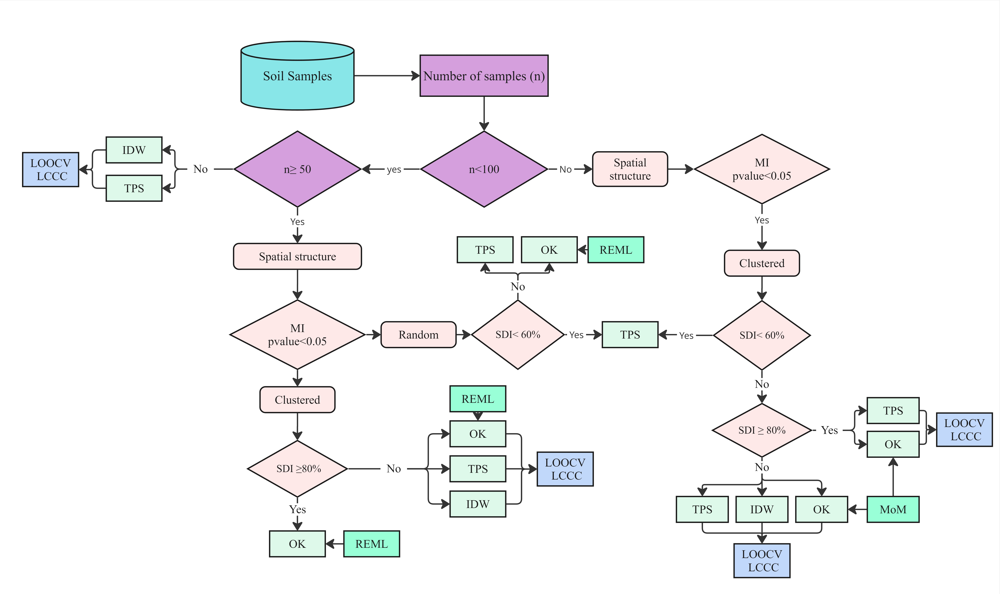
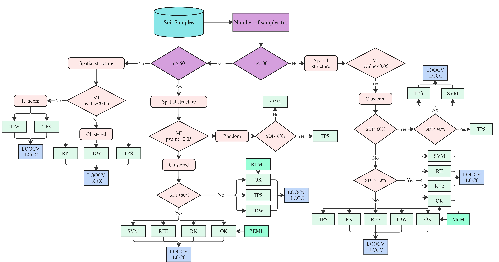

# Best Fit Interpolator

<p align="center">
  
</p>

<p align="center">
  <strong>A QGIS plugin for selecting, validating, and applying the most suitable spatial interpolation method for environmental and soil data.</strong>
</p>

<p align="center">
  <a href="https://github.com/ladelgadobe/BestFitInterpolation/issues">Report an issue</a> |
  <a href="https://doi.org/10.1007/s11119-025-10311-8">Reference article</a> |
  <a href="mailto:ladelgadobe@unal.edu.co">Contact</a>
</p>

## Overview

Best Fit Interpolator is a QGIS plugin designed to support spatial interpolation workflows, especially in digital soil mapping and precision agriculture. It helps users inspect their data, compare interpolation methods, validate predictions, and generate interpolation maps from point samples and polygon boundaries.

The plugin combines deterministic, geostatistical, machine-learning, and hybrid approaches in a single workflow:

- Inverse Distance Weighting (IDW)
- Thin Plate Spline (TPS)
- Ordinary Kriging (OK)
- REML-assisted kriging
- Random Forest (RF)
- Support Vector Machine (SVM)
- Regression Kriging (RK)

## Main Features

- Data diagnostics for point samples, variables, polygon limits, sample size, and spatial pattern.
- Semivariogram preview and geostatistical tools for kriging workflows.
- Cross-validation with RMSE, RMSE %, MAE, Pearson r, R², and LCCC.
- Observed-vs-predicted plots for comparing model behavior.
- Framework-guided method selection inspired by the reference article.
- Interpolation map generation directly inside QGIS.
- PDF report support for framework validation outputs.

## Version 2.0

- Outlier diagnostic combines IQR, MAD and optional Z flags with Global Moran and Local Moran/LISA; sample exclusions remain explicit user decisions.
- Reopening starts a clean session. IDW and TPS controls are separated; Regression Kriging keeps RF and residual kriging side by side with a shared adjustment dialog.
- MoM shows experimental semivariances and its model; REML shows the fitted theoretical model only. Advanced dialogs compare all three models and explain the numerical selection.
- Framework can prepare, validate and run RF, SVM and RK directly, and reports the method that successfully produced the final interpolation.
- Comparison shows aligned maps and their signed difference. Report includes an interactive summary, temporary browser HTML with collapsible sections, and PDF export.
- Map settings show palette gradients in a popup and preserve colors, scale and value limits in Larger View. Validation plots have no palette controls.
- Normal, dense and massive profiles bound tuning, prediction blocks and spatial neighborhoods; the actual validation strategy and sample count are disclosed.
- Automatic Global Moran uses all valid samples with spatial indexing and adaptive permutation counts. Outlier diagnostic retains its explicit neighborhood and permutation settings.
- Qt5/Qt6 and Matplotlib compatibility fixes restore embedded previews; native NumPy indices support 32-bit QGIS and machine-learning dependencies are isolated by Python/platform ABI.
- The updated English manual uses current Paulínia screenshots and documents outlier parameters, MoM/REML, map comparison, reports and dense/massive workflows.

## Version 1.1

- Keeps the Framework semivariogram preview synchronized with Geostatistics.
- Blocks interpolation for incompatible CRS or missing spatial overlap.
- Presents warnings and errors as popup alerts without interrupting routine information messages.
- Fixes TPS routing and REML prediction errors.
- Standardizes R² labels and automatic cross-validation guidance.
- Adds an About tab with documentation, support, article, and author links.

## Framework Guidance

The Framework tab guides method selection using the data characteristics and the decision structure proposed in the reference article.

<p align="center">
  
</p>

<p align="center">
  
</p>

## Installation

### From the QGIS Plugin Repository

1. Open **Plugins > Manage and Install Plugins** in QGIS.
2. Search for **Best Fit Interpolator**.
3. Select the plugin and click **Install Plugin**.

### From a ZIP release

1. Download the plugin ZIP from the [latest GitHub release](https://github.com/ladelgadobe/BestFitInterpolation/releases/latest).
2. In QGIS, open **Plugins > Manage and Install Plugins > Install from ZIP**.
3. Select the downloaded ZIP and click **Install Plugin**.

Machine-learning and hybrid methods require additional Python packages. If they
are not already available, the plugin asks for permission to install them into
its local `_deps` directory the first time one of these methods is used. This
step requires an internet connection but does not require administrator access.

Developers can also clone this repository and copy the `bestfitinterpolator`
folder into their QGIS plugins directory.

Typical QGIS plugin directory on Windows:

```text
C:\Users\<user>\AppData\Roaming\QGIS\QGIS3\profiles\default\python\plugins
```

## Authors

- [Laura Delgado Bejarano](https://www.linkedin.com/in/laura-delgado-bejarano-09b6681a2/)
- [Lucas Rios do Amaral](https://www.linkedin.com/in/lucas-rios-do-amaral-bb302449/)

Contact: [ladelgadobe@unal.edu.co](mailto:ladelgadobe@unal.edu.co)

## Citation

Laura Delgado Bejarano, Agda Loureiro Gonçalves Oliveira, João Vitor Fiolo Pozzuto, Dario Castañeda Sánchez, and Lucas Rios do Amaral (2026). *Performance of interpolation methods in digital soil mapping: the influence of data characteristics*. Precision Agriculture, 27, Article 10. https://doi.org/10.1007/s11119-025-10311-8

## User Manual

[Open the current user manual](https://github.com/ladelgadobe/BestFitInterpolation/blob/main/BestFitInterpolator_User_Manual.pdf).

## Repository

- Homepage: https://github.com/ladelgadobe/BestFitInterpolation
- Issues: https://github.com/ladelgadobe/BestFitInterpolation/issues
